# The Magic Flow: Provisioning & IoT Webhooks 🚀

_(Explained like you're in junior high, structured like a Google L8 Design Doc)_

## 1. The Big Picture (TL;DR)

Imagine you bought a brand new robot (the **ESP32 hardware**). Out of the box, it’s clueless. It doesn't know your WiFi password, it doesn't know what machine it belongs to, and it doesn't know who its boss is.

Instead of doing complicated coding to teach it, we just plug it into the computer with a USB cable. The website (`/admin/provisioning`) injects all the brains it needs directly through the browser. Once it has its brains, it connects to the WiFi and constantly asks the server, _"Did anyone scan a QR code yet?"_ When someone finally scans, the server says _"YES!"_, and the robot opens the gate.

---

## 2. The Visual Flow (Mermaid Chart)

Here is the exact step-by-step dance between the Admin, the Hardware, and the Server.

```mermaid
sequenceDiagram
    autonumber

    participant Admin as Admin Dashboard<br/>(Browser)
    participant USB as ESP32 Hardware<br/>(via USB)
    participant WiFi as ESP32 Hardware<br/>(via WiFi)
    participant API as Node.js API Server<br/>(iotState)
    participant Scanner as Operator<br/>(Scanner App)

    %% Phase 1: Provisioning
    rect rgb(30, 30, 40)
    note right of Admin: Phase 1: Zero-Touch Provisioning (The Setup)
    Admin->>USB: Connect via WebSerial (USB Cable)
    Admin->>USB: Send JSON Config (WiFi, API IP, Machine, QR)
    USB-->>Admin: Acknowledges saved!
    USB->>WiFi: Reboots & connects to Factory WiFi
    end

    %% Phase 2: The Waiting Game
    rect rgb(40, 30, 30)
    note right of Admin: Phase 2: Polling (The "Are we there yet?" loop)
    loop Every 500ms
        WiFi->>API: GET /iot/{machine}/{qr} (Is it scanned?)
        API-->>WiFi: {scanned: false} (Nope, keep waiting)
    end
    end

    %% Phase 3: The Trigger
    rect rgb(30, 40, 30)
    note right of Admin: Phase 3: The Webhook Action (The Scan)
    Scanner->>API: Scans QR (POST /api/qr/process)
    API->>API: setIotScanned() -> flips memory to TRUE
    API-->>Scanner: Scan Success!

    WiFi->>API: GET /iot/{machine}/{qr} (Is it scanned?)
    API-->>WiFi: {scanned: true} (YES! Do your thing!)
    WiFi->>WiFi: *Triggers Physical Gate/Relay*

    WiFi->>API: POST /iot/{machine}/{qr}/reset
    API->>API: resetIotScanned() -> flips memory back to FALSE
    API-->>WiFi: Reset acknowledged
    end
```



---

## 3. Deep Dive: How the Pieces Work

### Phase 1: The Provisioning (`/admin/provisioning`)

**The Problem:** Normally, to update a microchip's WiFi or give it a new ID, you have to install bulky software (like Arduino IDE), write code, and flash it. That takes 15 minutes per device.
**The L8 Solution (WebSerial):** We use a modern browser feature called **WebSerial**.

- **What it does:** The website talks directly to the USB port.
- **The UX:** The admin selects a Machine (e.g., `MC#2`) and a QR code (e.g., `QR-1004`), types the WiFi password, and clicks "Simpan".
- **The Result:** A tiny JSON string (like `{ "cmd": "config", "wifi_ssid": "...", "machine_code": "mc2" }`) is zapped into the ESP32. The ESP32 saves this in its permanent memory (NVS) and restarts. Zero code required.

### Phase 2: The IoT State (The "Webhook" Replacement)

**The Problem:** Traditional webhooks require the server to push data _to_ the hardware. But hardware devices on a factory floor often change IP addresses or get blocked by firewalls.
**The L8 Solution (In-Memory Polling):**
Instead of the server pushing data, the hardware _pulls_ data. We built an incredibly lightweight in-memory store (`iotState.ts`).

- **No Database:** It uses a simple Javascript `Map()`. It's blazing fast and doesn't clutter a SQL database with temporary junk data.
- **The Loop:** Every half a second (500ms), the ESP32 asks the server: `GET /iot/mc2/QR-1004`. The server replies `{scanned: false}`.

### Phase 3: The Trigger (Scan & Reset)

**The Action:**

1. An operator scans the physical QR code with their app.
2. The server processes the scan. If successful, it calls `setIotScanned()`. This instantly flips our in-memory `Map()` from `false` to `true`.
3. A split-second later, the ESP32 does its normal 500ms check. But this time, the server replies `{scanned: true}`!
4. **Hardware Magic:** The ESP32 sees the `true`, fires electricity to a relay, and the physical gate opens or a green light turns on.
5. **The Clean Up:** The ESP32 immediately tells the server: `POST /iot/mc2/QR-1004/reset`. The server flips the memory back to `false` so the gate doesn't just keep opening endlessly. (We also have a 60-second safety timeout just in case the ESP32 loses power before resetting).

---

## 4. Why this design is "Senior Level" (L8)

1. **YAGNI (You Aren't Gonna Need It):** We avoided heavy MQTT brokers, Kafka queues, or Redis caches. A simple Node.js `Map()` handles thousands of requests per second perfectly for this use case.
2. **Zero-Touch UX:** Factory workers don't need to be IT experts to setup hardware. WebSerial democratizes the hardware setup.
3. **Resilience:** If the WiFi drops, the ESP32 just keeps trying. Once WiFi is back, it resumes polling. No missed "push" events. If the Node server restarts, the state clears automatically (which is safe, it just means a scan mid-restart might require a re-scan, avoiding stale physical gate triggers).

---

## 5. Bug Report: Why `/iot/mc2/QR-1004` Stays `false` After Scanning

> **Status:** Known behavior, intentional gate. Root cause documented below.

### 5.1 The Exact Line That Is the Gatekeeper

In `server/routes/qr.ts`, after a successful scan, the IoT signal fires **only under this condition** (line 650):

```typescript
// qr.ts — line 650
if (requestUser?.type === "station" && requestUser?.device_id) {
  // ✅ Only here does setIotScanned() get called
}
// else:
// console.log("[IOT_DEBUG] Scan did not trigger IoT because user is not a station or lacks device_id.");
```

**Translation for humans:** The server doesn't care _where_ you scanned (admin dashboard, station dashboard, Postman, doesn't matter). It only checks **WHO your JWT says you are**. Specifically: was your login token minted for a `station` device with a `device_id`?

### 5.2 Root Cause Decision Tree

```
You scan QR-1004 on /station/dashboard
         │
         ▼
Did you log in using a Station Device JWT?
(i.e., the token has { type: "station", device_id: <N> })
         │
    ┌────┴────┐
   YES        NO (you're admin/user)
    │          │
    ▼          ▼
setIotScanned() fires   ⛔ setIotScanned() SKIPPED
/iot/mc2/QR-1004 → true  /iot/mc2/QR-1004 stays false
Gate opens ✅             Gate stays closed ❌
```

**Why does this gate exist?** It's intentional safety. An admin scanning a QR from their desk should NOT accidentally open a physical factory gate. Only a registered, provisioned station device should trigger the gate. This is correct security design.

### 5.3 How to Confirm Right Now (Without Touching Any Code)

**Step 1 — Check the server logs.** The `[IOT_DEBUG]` log lines are already in the code. When you scan, look at your `npm run dev:all` terminal output:

```
# If you see this → you scanned as admin, not as a station:
[IOT_DEBUG] Scan did not trigger IoT because user is not a station or lacks device_id.

# If you see this → good, IoT fired:
[IOT_DEBUG] Setting state for iotPath: /webhook/mc2/QR-1004
```

**Step 2 — Check the IoT debug endpoint** (requires internal key):

```
GET /iot/debug
```

This shows everything currently in the in-memory map. If it's empty, nothing has ever fired since the server started.

**Step 3 — Manually fire the signal for testing** (requires internal key):

```bash
curl -X POST http://localhost:4000/iot/set/mc2/QR-1004 \
  -H "x-internal-key: YOUR_INTERNAL_KEY"
```

Then immediately check `GET /iot/mc2/QR-1004`. If it's `true`, your polling setup works fine — the only missing piece was the station JWT.

### 5.4 The "Headache Prevention" Checklist

Here is the method to never hit this confusion again, structured as a runbook:

| Symptom                           | Cause                                     | Fix                                                                                                                                                      |
| --------------------------------- | ----------------------------------------- | -------------------------------------------------------------------------------------------------------------------------------------------------------- |
| `/iot/mc2/QR-1004` always `false` | Scanning as admin user                    | Log into `/station/dashboard` via a **station device account**, not as admin                                                                             |
| `/iot/mc2/QR-1004` always `false` | `machine_origin` is empty on the QR in DB | When generating the QR, set `machineOrigin = "MC#2"` so the webhook path can be built                                                                    |
| `/iot/mc2/QR-1004` always `false` | Wrong `mc` slug normalization             | The code does `machineOrigin.toLowerCase().replace(/[^a-z0-9]/g, "")` — so `MC#2` becomes `mc2`. Your ESP32 must provision with the same normalized slug |
| IoT fires but ESP32 doesn't react | ESP32 polled a different path             | Check what `webhook_path` was saved in the ESP32's NVS during provisioning. Must match `/webhook/mc2/QR-1004` exactly (case-sensitive on QR ID)          |

### 5.5 The Normalization Trap (Most Common Gotcha)

The path key is built in two separate places and **both must produce the same string** or you'll get a permanent mismatch:

```
qr.ts (server-side, at scan time):
  machineOriginForWebhook = "MC#2"
  mc = "MC#2".toLowerCase().replace(/[^a-z0-9]/g, "")  →  "mc2"
  qrId = "QR-1004" (from DB, already uppercase)
  iotPath = "/webhook/mc2/QR-1004"  ✅

admin.provisioning.tsx (browser-side, at ESP32 setup time):
  mcNormalized = "MC#2".toLowerCase().replace(/[^a-z0-9]/g, "")  →  "mc2"
  webhookPath = "/webhook/mc2/QR-1004"  ✅ (matches!)
```

If the ESP32 was provisioned with `machine_code: "MC2"` (no `#`) or `machine_code: "mc#2"` (lowercase `#`), the normalization produces the same `mc2`. Safe.

But if someone provisioned the ESP32 with a typo like `machine_code: "Machine 2"` → `machine2`, it will poll `/webhook/machine2/QR-1004` while the server sets `/webhook/mc2/QR-1004`. **They never match. The gate never opens.** Re-provision to fix.

### 5.6 The Permanent Solution: A `/iot/lookup` Helper Endpoint (Recommended Addition)

_No code changes made — this is the recommended design for the next iteration._

Instead of forcing humans to guess the right path, add a read-only diagnostic endpoint that shows, given a `qr_id` and `machine_code`, exactly what path the server would compute and what its current state is:

```
GET /iot/lookup?machine=MC%232&qr=QR-1004
→ {
    "computedPath": "/webhook/mc2/QR-1004",
    "currentState": false,
    "lastTs": null,
    "hint": "Scan from a station device to trigger. Ensure ESP32 was provisioned with this exact path."
  }
```

This single endpoint eliminates the "which path does my machine use?" confusion entirely. An admin can open this in the browser and immediately see the computed path and live state side by side.

---

## 6. "I AM on Station — But I Still Don't Know Which `/iot/` Path Turned True"

> This is the core UX headache. You scanned correctly, IoT fired somewhere in memory, but you're stuck guessing URLs. Here's the exact solution.

### 6.1 The Answer Is Already In Your Terminal

The server **literally logs the exact key it set** every single scan. Look at your `npm run dev:all` terminal right after scanning:

```
[IOT_DEBUG] Setting state for iotPath: /webhook/mc2/QR-1004
```

That value after `iotPath:` is the **exact and only** string you paste into the browser:

```
GET http://localhost:4000/iot/mc2/QR-1004
                                ↑
                         copy-paste from the log
```

No guessing. The server told you. You just need to look at the terminal.

### 6.2 If You Miss the Log — Use `/iot/debug` to See ALL Keys

`/iot/debug` dumps every single entry currently in the in-memory map. It's a snapshot of the entire "who is scanned right now" state:

```bash
# Replace YOUR_KEY with the value of INTERNAL_KEY in your .env
curl http://localhost:4000/iot/debug \
  -H "x-internal-key: YOUR_KEY"
```

Response looks like:

```json
{
  "totalEntries": 2,
  "entries": {
    "/webhook/mc2/QR-1004": { "scanned": true, "ts": "2026-07-31T04:02:00.000Z" },
    "/webhook/mc1/QR-1002": { "scanned": false, "ts": "2026-07-31T03:55:00.000Z" }
  }
}
```

Every key in `entries` is a valid URL you can query directly. If `scanned: true` is there, your gate signal is live.

> **Key insight:** The map key is built from `machine_origin` in the DB, not from what you type in the browser. The terminal log and `/iot/debug` always show the ground truth. The browser URL is the thing that needs to match them — not the other way around.

### 6.3 The Formula (So You Can Predict It Without Looking at Logs)

```
machine_origin from DB   →   strip non-alphanumeric, lowercase
"MC#2"                   →   "mc2"
"MC 2"                   →   "mc2"
"Machine#2"              →   "machine2"  ← this one trips people up

qr_id from DB            →   force UPPERCASE (already uppercase in practice)
"QR-1004"                →   "QR-1004"

Final path:
/iot/{normalized_machine}/{qr_id_uppercase}
/iot/mc2/QR-1004
```

Open your DB, look at the `machine_origin` column for the QR you scanned, apply the formula. That's your URL.

### 6.4 The Two-Line Self-Check Protocol (Runbook)

Next time you scan on `/station/dashboard` and want to verify IoT fired:

**1. Scan the QR.** Look at the terminal immediately.

```
→ You MUST see: [IOT_DEBUG] Setting state for iotPath: /webhook/...
→ If you see: "Scan did not trigger IoT..." — wrong user type, re-check login
→ If you see: "No machineOriginForWebhook" — the QR has no machine_origin in DB
```

**2. Copy the exact path from the log. Paste into browser.**

```
GET /iot/{exact-path-from-log}
→ { "scanned": true }  ← gate signal is live ✅
→ { "scanned": false } ← impossible if log said it fired. Server restarted? Map cleared.
```

Done. Two steps, zero guessing.

### 6.5 Why "Guessing the URL" Is an Unsolved UX Problem

The architectural reason this feels painful: the IoT map key lives **only in server memory** and the only way to observe it is via logs or `/iot/debug`. There's no UI in the dashboard that shows "here are the currently hot IoT paths."

The `/iot/lookup` endpoint described in §5.6 solves this permanently — it lets you go from _human-readable names_ (`MC#2`, `QR-1004`) to the _computed path + live state_ in one browser request. Once that's built, you never need to read logs or guess URLs again.
